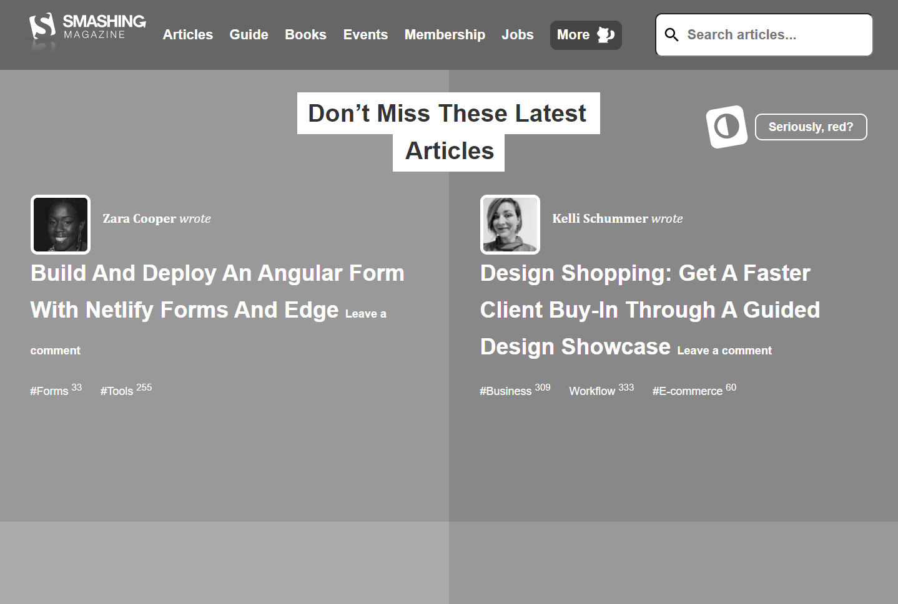
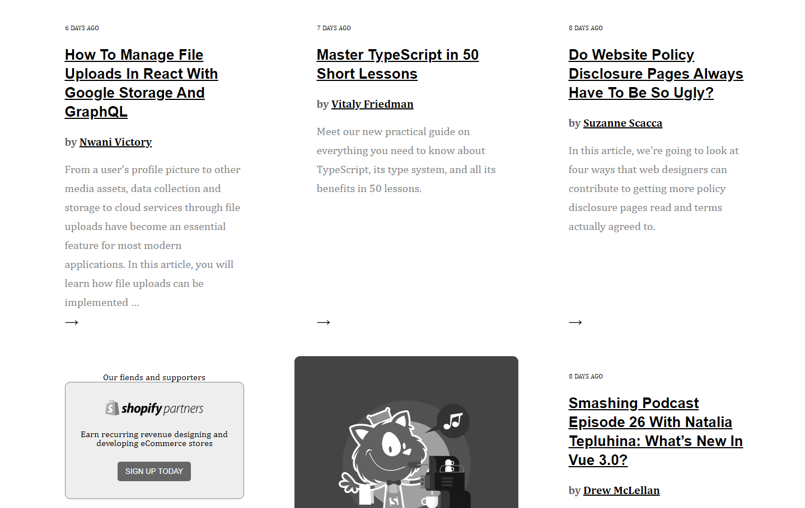
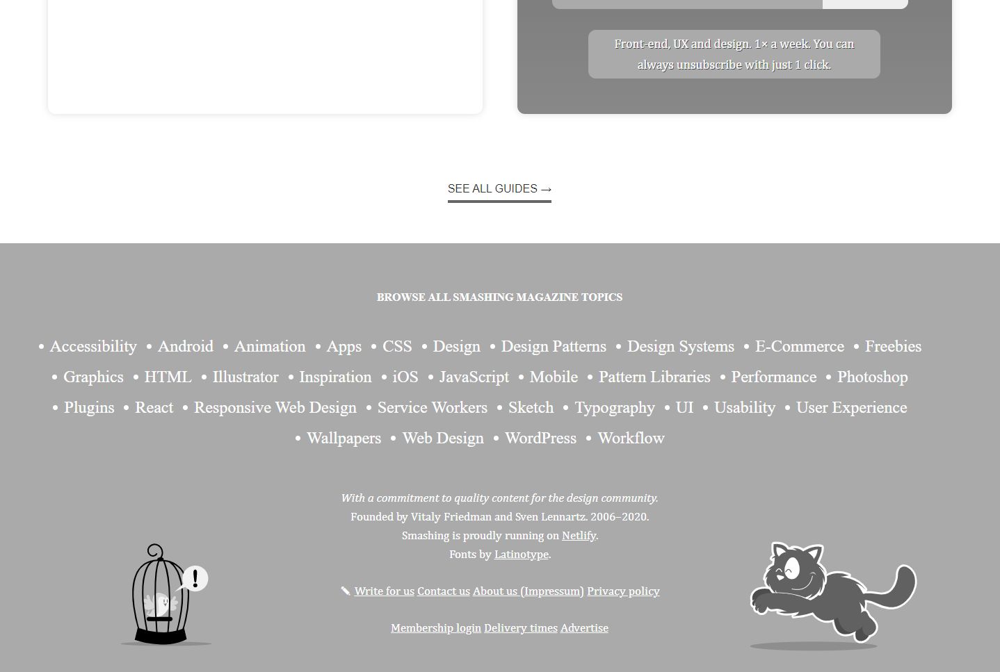

# Smashing Magazine Heatmap

> This project consists of building a heatmap of the [Smashing magazine](https://www.smashingmagazine.com/) website.

Additional description about the project and its features.

## Built With

- HTML
- CSS

## Live Demo

[Live Demo Link](https://brenoxav.github.io/smashing-magazine-heatmap/)

## Authors

👩‍💻 **Ana Paula Hübner**

- GitHub: [@anapdh](https://github.com/anapdh)
- Twitter: [@anapdh](https://twitter.com/anapdh)
- LinkedIn: [Ana Paula Hübner](https://www.linkedin.com/in/ana-paula-h%C3%BCbner-7a9484181/)

👨‍💻 **Breno Xavier**

- GitHub: [@brenoxav](https://github.com/brenoxav)
- LinkedIn: [Breno Xavier](https://linkedin.com/brenoxav)

## Show your support

Give a ⭐️ if you like this project!

## 📝 License

This project is [MIT](lic.url) licensed.